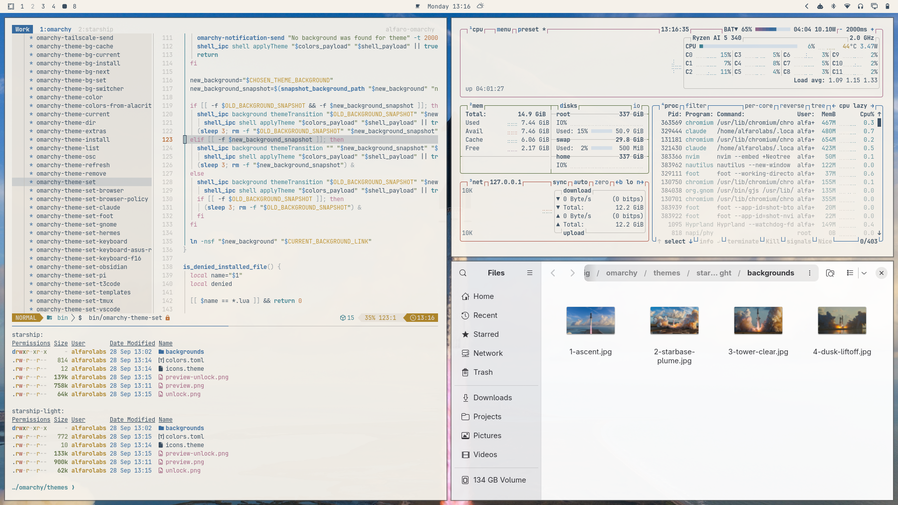
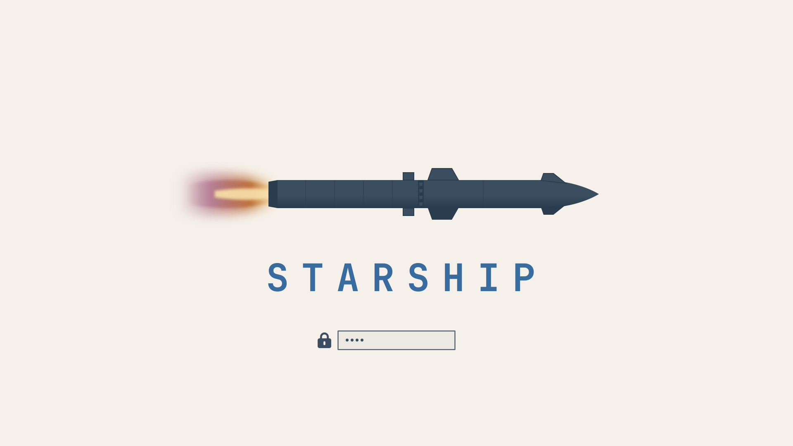

# Starship Light — Omarchy theme

A light Omarchy theme drawn from SpaceX Starship launch photography: sunlit-cloud paper, deep Gulf-sea ink, a morning-sky blue accent, and dusty flame, plume and marsh tones.



## Install

```bash
omarchy theme install https://github.com/alfarolabs/omarchy-starship-light-theme
```

Or from the desktop: `Super + Alt + Space` → Install → Style → Theme, then paste the URL above.

The theme shows up as **Starship Light** in the theme switcher.

Looking for the dark version? See [Starship](https://github.com/alfarolabs/omarchy-starship-theme).

## Login screen

The theme ships an `unlock.png` for the Plymouth boot / disk-unlock screen:



```bash
omarchy plymouth set-by-theme starship-light
```

## Palette

Every color was sampled from the launch photos in `backgrounds/`, then softened for long sessions.

| Role       | Hex         | Source                 |
|------------|-------------|------------------------|
| background | `#f5f1ea` | sunlit cloud |
| foreground | `#3b4e60` | Gulf sea |
| accent     | `#386b9e` | morning sky |
| selection  | `#d9e1e8` | |
| muted      | `#c6c2bc` | |
| red        | `#b25a4c` | engine glow |
| yellow     | `#b08526` | flame |
| orange     | `#c0743e` | flame |
| green      | `#617345` | Boca Chica marsh |
| cyan       | `#3f8290` | Gulf water |
| blue       | `#386b9e` | sky |
| magenta    | `#a86683` | exhaust plume |

Everything else (terminals, Neovim, btop, shell, Hyprland borders, lock screen, VS Code, ...) is generated by Omarchy from `colors.toml`.

Icons: `Yaru-blue`

## Backgrounds

- `1-ascent.jpg`
- `2-starbase-plume.jpg`
- `3-tower-clear.jpg`
- `4-dusk-liftoff.jpg`

Starship launch photography by SpaceX. The photos belong to their owners and are **not** covered by this repository's MIT license, which applies to the palette, logo and other files.
